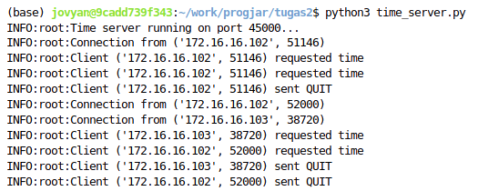
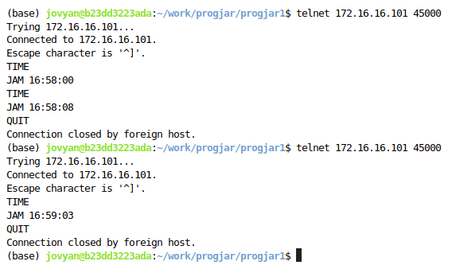
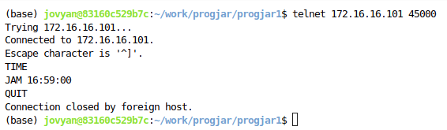

# Tugas 2 Pemrograman Jaringan

## Cara Menjalankan Program
1. Jalankan server pada mesin-1
    ```bash
    python3 time_server.py
    ```
2. Pastikan mesin-2 dan mesin-3 sudah terinstal Telnet pada terminal
    ```bash
    sudo apt install telnet
    ```
3. Sambungkan koneksi mesin-2 dan mesin-3 ke mesin-1
    ```bash
    telnet 172.16.16.101 45000
    ```
4. Ketikkan perintah `TIME` pada mesin-2 dan mesin-3 untuk mendapatkan waktu dari server
    ```bash
    TIME
    ```
5. Ketikkan perintah `QUIT` pada mesin-2 dan mesin-3 untuk keluar dari server
    ```bash
    QUIT
    ```

## Hasil
- Server

- Mesin-2

- Mesin-3


> Andika Rahman Teja (5025221022)