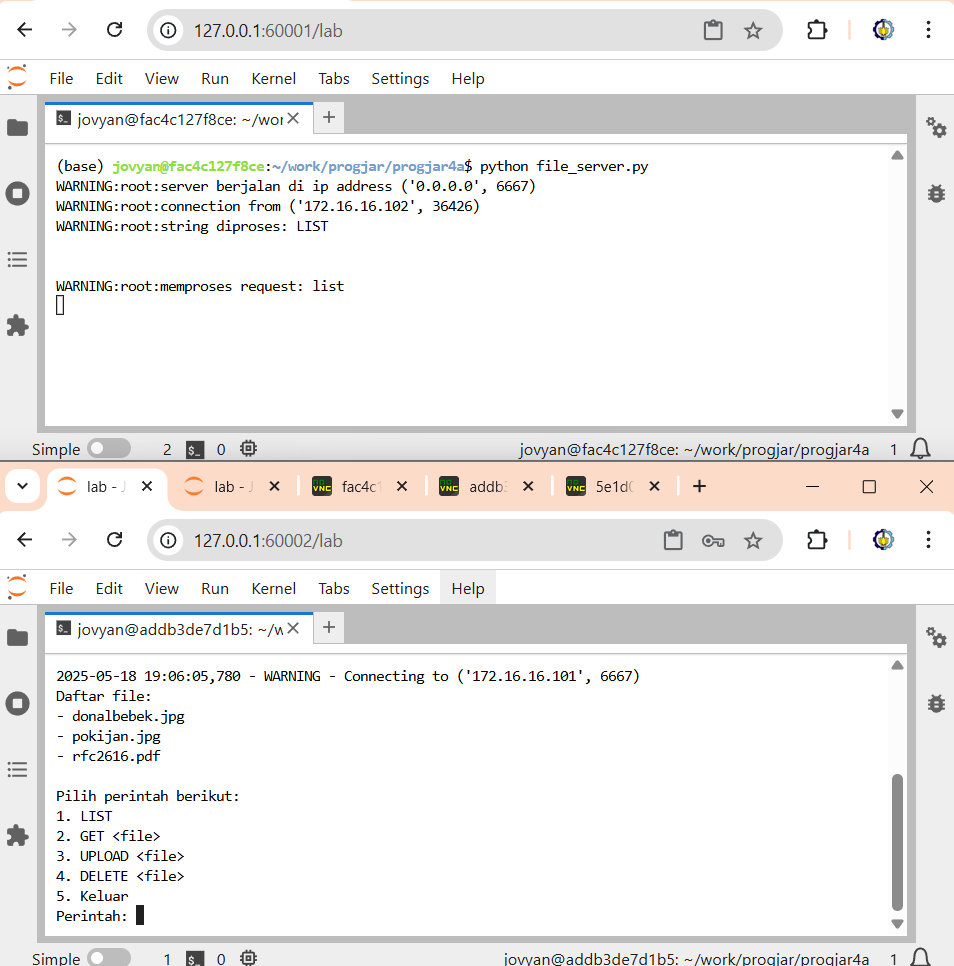
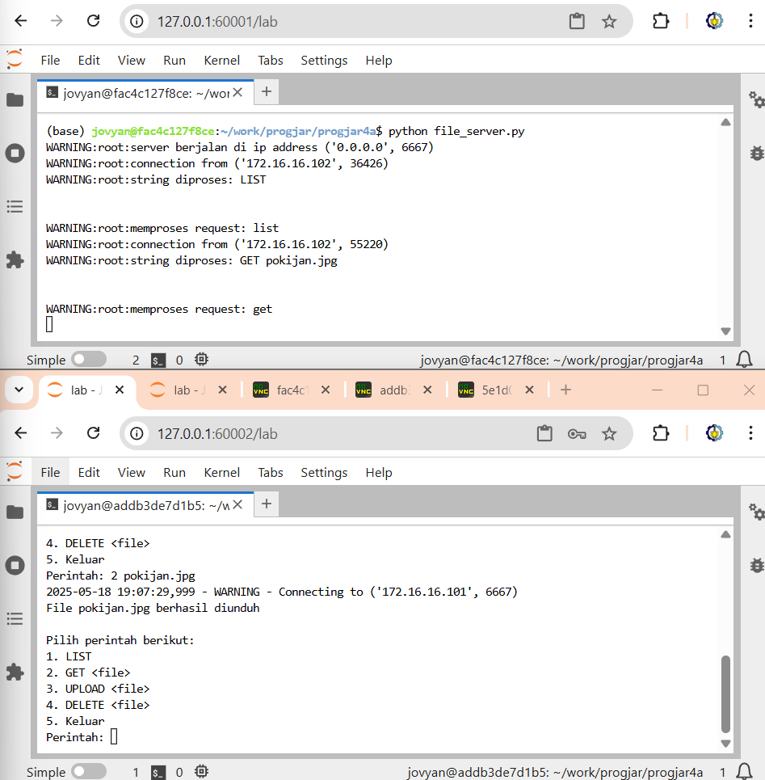
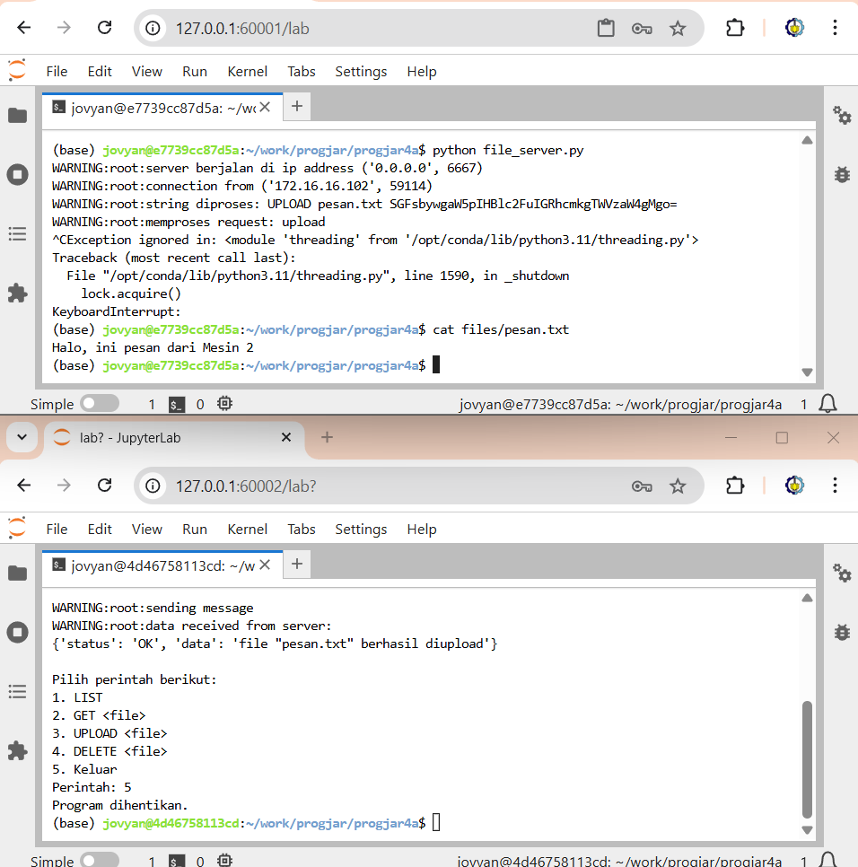
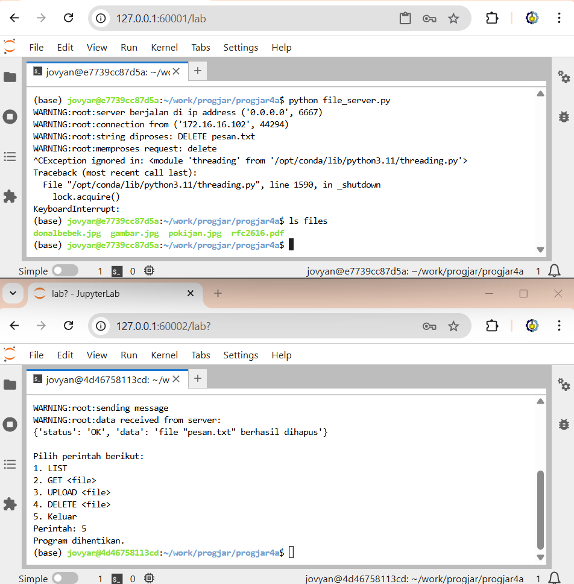

# Tugas 3

## Deskripsi
Folder ini berisi implementasi File Server sederhana berbasis socket yang dapat menerima perintah dari client untuk melakukan operasi file seperti `LIST`, `GET`, `UPLOAD`, dan `DELETE` sesuai protokol yang dijelaskan pada [PROTOKOL.txt](PROTOKOL.txt).

## Cara Menjalankan

### 1. Jalankan Server
```bash
python file_server.py
```
Secara default server akan berjalan di `0.0.0.0:6667`.

### 2. Jalankan Client
```bash
python file_client_cli.py
```
Client akan terhubung ke server pada alamat dan port yang sudah ditentukan di kode.

### 3. Perintah yang Didukung
- **LIST**  
  Melihat daftar file yang tersedia di server.
- **GET &lt;nama_file&gt;**  
  Mengunduh file dari server.
- **UPLOAD &lt;path_file&gt;**  
  Mengunggah file ke server.
- **DELETE &lt;nama_file&gt;**  
  Menghapus file di server.

## Penjelasan Kode

- [`file_server.py`](file_server.py):  
  Membuka socket server, menerima koneksi, dan membuat thread baru untuk setiap client. Setiap perintah client diproses menggunakan [`FileProtocol`](file_protocol.py). Pada kode ini, asumsi mesin-1 jadi server.

- [`file_protocol.py`](file_protocol.py):  
  Melakukan parsing string perintah dari client, memanggil fungsi yang sesuai di [`FileInterface`](file_interface.py), dan mengembalikan hasil dalam format JSON.

- [`file_interface.py`](file_interface.py):  
  Berisi fungsi-fungsi untuk operasi file (list, get, upload, delete) di folder `files/`. File dikirim/diterima dalam format base64 untuk GET dan UPLOAD.

- [`file_client_cli.py`](file_client_cli.py):  
  CLI interaktif untuk mengirim perintah ke server dan menampilkan hasilnya ke user.

## Hasil

### 1. LIST


### 2. GET


### 3. UPLOAD


### 4. DELETE


---

> Andika Rahman Teja (5025221022)